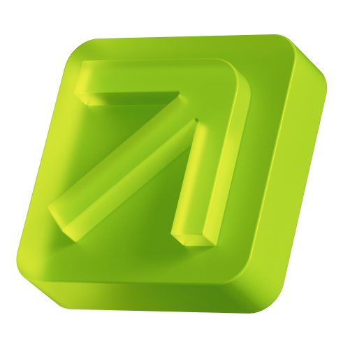

<p align="center">
  
</p>

<h1 align="center">PARK Token</h1>

<p align="center">
  <picture>
    <source media="(prefers-color-scheme: dark)" srcset="assets/earnpark-wordmark-on-dark.png" />
    
  </picture>
</p>

<p align="center">
  <a href="https://earnpark.com">earnpark.com</a> · <a href="LICENSE">BUSL-1.1</a> · <a href="docs/AUDIT-SCOPE.md">Audit scope</a> · <a href="SECURITY.md">Security policy</a>
</p>

<p align="center">
  <a href="https://docs.earnpark.com/token-whitepaper/abstract">Whitepaper</a> · <a href="https://docs.earnpark.com/token-whitepaper/park-token">Token doc</a> · <a href="https://www.coingecko.com/en/coins/park">CoinGecko</a>
</p>

---

ERC-20 utility token for earnpark.com, deployed on BNB Smart Chain via the
ZeframLou CREATE3 Factory for deterministic addressing across EVM chains.

PARK is the platform utility token used for staking, rewards, and governance
participation in the EarnPark ecosystem (https://earnpark.com). The token
whitepaper, tokenomics, and live market data live at:

- **Whitepaper abstract:** https://docs.earnpark.com/token-whitepaper/abstract
- **Token specification:** https://docs.earnpark.com/token-whitepaper/park-token
- **Market data:** https://www.coingecko.com/en/coins/park
The contract is a **capped-supply** ERC-20 (1 B PARK hard cap, 6 decimals) with
**admin reissuance up to the cap**: holder burns reduce `totalSupply()` and
create headroom that `DEFAULT_ADMIN_ROLE` can mint back via `mint()`. The cap
itself is immutable (returned by a `pure` override). Other surface: UUPS
upgradeability under Safe + Timelock governance, USDC-style stuck-token
rescue, ERC-2612 gasless approvals, and the hard cap enforced at the
`_update` level. See `docs/TOKEN-SPEC.md` for the full surface and
`docs/UPGRADE-HAZARDS.md` for the cap-storage upgrade contract.

## Contract

- **Source:** `contracts/ParkToken.sol`
- **Standards:** ERC-20, ERC-2612 Permit, ERC-1967 UUPS proxy, ERC-7201 namespaced storage
- **OpenZeppelin v5.6.1** (capped, burnable, permit, access-control with default-admin-rules)

PARK Token uses four AccessControl roles: `DEFAULT_ADMIN_ROLE` (held by Safe), `UPGRADER_ROLE` (held by Timelock), `RESCUER_ROLE` (held by a dedicated rescuer EOA), and `TIMELOCK_ADMIN_ROLE` (held by Timelock; the only role that can grant/revoke `UPGRADER_ROLE`).

## Quick start

```bash
git clone <repository-url>
cd park-token-public
# lib/ is fully vendored — no submodule init needed
npm install --ignore-scripts
forge build --offline        # Foundry artifacts (out/) — audit anchor
npx hardhat compile          # Hardhat artifacts (artifacts/) — deploy + TS-test path
forge test --offline -vvv    # 86 Foundry tests (78 unit + 8 invariant)
npm run hh:test              # 34 TS unit tests
```

Expected output: 86 Foundry tests pass (78 unit + 8 invariant) plus 34 TS unit tests.
Both Foundry and Hardhat artifact families are baselined in
`docs/BYTECODE-BASELINE.md`; `scripts/repro.sh` asserts each row.

## Deploy (BSC mainnet)

Live production addresses are in [`docs/DEPLOYMENTS.md`](docs/DEPLOYMENTS.md).
See `docs/DEPLOY-MECHANIC.md` for the full operator runbook. Short version:

```bash
cp .env.example .env
# fill in BSC_RPC_URL, BSC_PRIVATE_KEY, BSC_DEFAULT_ADMIN_ADDRESS, etc.
npm run hh:deploy:base:bsc
```

## Reproducibility verification

To verify the bytecode an auditor builds matches the documented baseline:
```bash
./scripts/repro.sh
```

Compare the printed hashes against the table in `docs/BYTECODE-BASELINE.md`.

## Audit

This repository is submitted for external security audit. See `docs/AUDIT-SCOPE.md` for in-scope files.

## License

BUSL-1.1 — see `LICENSE`.

All files in this repository, including TypeScript scripts and shell utilities, are governed by the root `LICENSE` (BUSL-1.1) unless they carry a different SPDX identifier.
